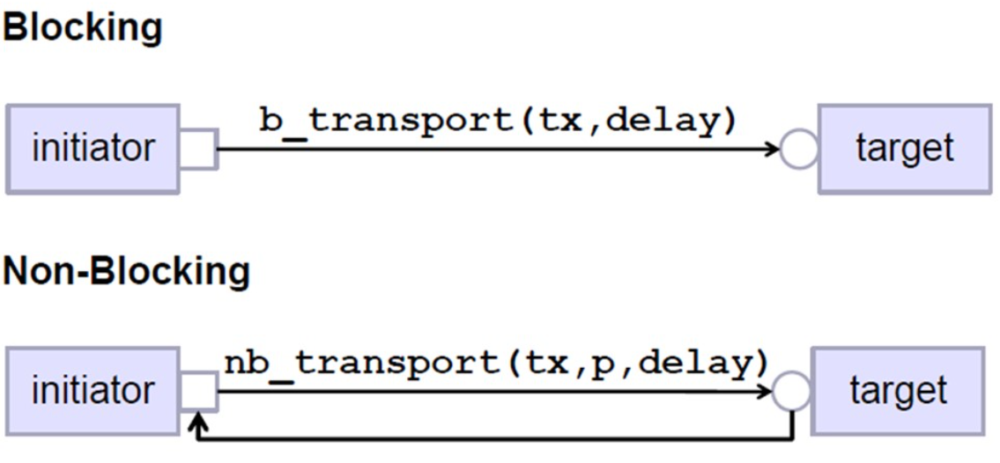

# TLM2.0 Sample UVM Code
## Description 
A demonstration of UVM TLM 2.0 Blocking and Non-Blocking Ports, accompanied by a Fundamental USB 2.0 Port Connection Illustration.

Transaction-Level Modeling (TLM) is a crucial aspect of the Universal Verification Methodology (UVM) for efficient and modular verification. 

This repository demonstrates the usage of TLM 2.0 features, specifically focusing on blocking and non-blocking ports, and provides a practical example of connecting ports using a basic USB 2.0 implementation. 

In TLM 2.0, communication between different components is facilitated through two distinct roles: the **Initiator** (sender) and the **Target** (receiver). 
### Blocking:
- Primarily employed for singular, one-time communication from the initiator to the target.
- Involves passing the transaction details and a designated delay as method arguments.
- Executed through the *b_transport* method
### Non-Blocking:
- Reserved for scenarios requiring dynamic back-and-forth interaction between the initiator and the target within a single transaction.
- Parameters for the transport method encompass the transaction itself, a designated phase, and a specified delay.
- The methods at play here are *nb_transport_fw* (non-blocking forward) and *nb_transport_bw* (non-blocking backward).

***
- ***Transaction Progress and Time Tracking:*** The delay parameter tracks how a transaction progresses over time.
- ***Migration from TLM 1.0:*** All UVM base classes inherently integrate the features of TLM 1.0. To fully embrace TLM 2.0's capabilities, the instantiation of port connections using sockets throughout the testbench is essential.
- ***Non-Blocking Transaction Closure:*** The transaction attains completion when the return value of "UVM_TLM_COMPLETED" is detected within the function.
***

## Features

- UVM TLM 2.0 blocking and non-blocking port implementations.
- Basic USB 2.0 implementation for illustrating port connections.

## EDA Playground links:
- [Blocking](https://www.edaplayground.com/x/sQyx)
- [Non-blocking](https://www.edaplayground.com/x/udAw)
- [USB2.0 Non-blocking](https://www.edaplayground.com/x/vhih)

TODO: Update ReadMe
